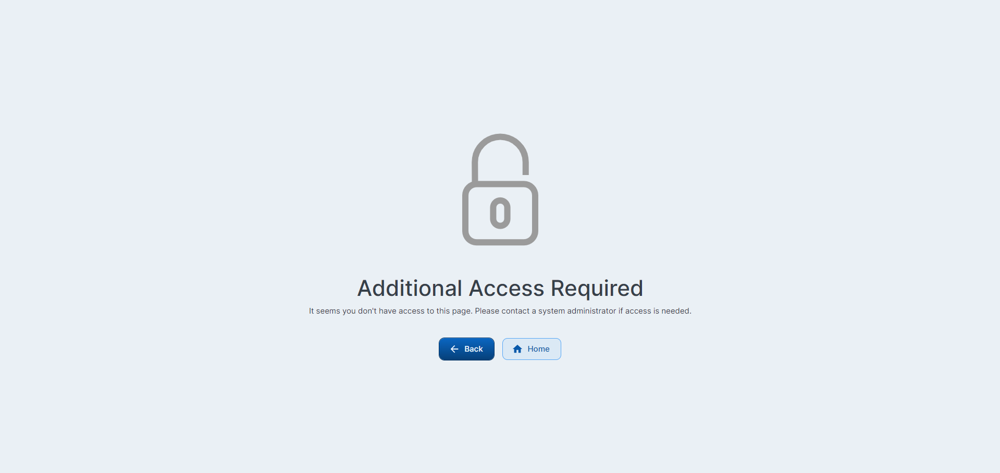

    
    

<h1>Safer</h1>

Welcome to Safer! Your ultimate travel accommodation booking platform. Seamlessly find and book the safest and most comfortable stays, from charming B&Bs to luxurious resorts, ensuring your travel is not just memorable but also secure. Dive into a hassle-free booking experience and set off on your next adventure with Safer.

## Technologies

In this project, I've used the following libraries:

- **[react](https://reactjs.org/)**: A JavaScript library for building user interfaces.
- **[react-dom](https://reactjs.org/docs/react-dom.html)**: Entry point of the DOM-related rendering paths.
- **[redux-persist](https://github.com/rt2zz/redux-persist)**: Persist and rehydrate a redux store.
- **[@reduxjs/toolkit](https://redux-toolkit.js.org/)**: The official, recommended way to write Redux logic.
- **[react-redux](https://react-redux.js.org/)**: Official React bindings for Redux.
- **[@tanstack/react-query](https://tanstack.com/query/latest)**: Powerful asynchronous state management for TS/JS, React, Solid, Vue, Svelte, and Angular.
- **[axios](https://axios-http.com/)**: Promise based HTTP client for the browser and Node.js.
- **[mui/material](https://mui.com/material-ui/)**: Material UI components for rich UI design.
- **[@mui/icons-material](https://mui.com/material-ui/material-icons/)**: Material Icons for Material UI.
- **[@mui/lab](https://mui.com/material-ui/about-the-lab/)**: Material UI Lab components.
- **[formik](https://formik.org/)**: Forms in React, without the tears.
- **[yup](https://github.com/jquense/yup)**: Dead simple Object schema validation.
- **[react-router-dom](https://reactrouter.com/web/guides/quick-start)**: DOM bindings for React Router.
- **[react-toastify](https://fkhadra.github.io/react-toastify/introduction)**: Easy toast notifications for React applications.
- **[@emotion/react](https://emotion.sh/docs/@emotion/react)**: A library designed for writing css styles with JavaScript.
- **[@emotion/styled](https://emotion.sh/docs/styled)**: Styled component library for Emotion.
- **[dayjs](https://day.js.org/)**: Fast 2kB alternative to Moment.js with the same modern API.
- **[date-fns](https://date-fns.org/)**: Modern JavaScript date utility library.
- **[leaflet](https://leafletjs.com/)**: An open-source JavaScript library for mobile-friendly interactive maps.
- **[react-leaflet](https://react-leaflet.js.org/)**: React components for Leaflet maps.
- **[lottie-react](https://lottiefiles.com/web-player)**: Lottie for React.
- **[react-slick](https://react-slick.neostack.com/)**: Carousel component built with React.
- **[slick-carousel](https://kenwheeler.github.io/slick/)**: The last carousel you'll ever need.
- **[react-spinners](https://www.npmjs.com/package/react-spinners)**: A collection of loading spinner components for React.
- **[react-world-flags](https://www.npmjs.com/package/react-world-flags)**: React component for displaying world flags.
- **[jwt-decode](https://github.com/auth0/jwt-decode)**: Decode JWT tokens, mostly useful for browser applications.
- **[js-cookie](https://github.com/js-cookie/js-cookie)**: A simple, lightweight JavaScript API for handling cookies.
- **[@types/react](https://www.npmjs.com/package/@types/react)**: TypeScript definitions for React.
- **[react-date-range](https://hypeserver.github.io/react-date-range/)**: A date library agnostic date picker.
- **[i18n-iso-countries](https://www.npmjs.com/package/i18n-iso-countries)**: ISO country codes for i18n.
- **[jest-environment-jsdom](https://jestjs.io/docs/configuration#testenvironment-string)**: Jest environment for jsdom.
- **[jest-preview](https://www.npmjs.com/package/jest-preview)**: Preview Jest snapshots in a browser.
- **[ts-jest](https://kulshekhar.github.io/ts-jest/)**: A Jest transformer with source map support that lets you use Jest to test projects written in TypeScript.
- **[ts-node](https://typestrong.org/ts-node/)**: TypeScript execution environment and REPL for Node.js.
- **[whatwg-fetch](https://github.com/github/fetch)**: A window.fetch polyfill.
- **[lucide-react](https://lucide.dev/docs/lucide-react)**: Beautiful and consistent icon toolkit.
- **[react-lucid](https://lucide.dev)**: A set of clear and elegant React icons for building visually appealing interfaces.

## Live Preview

<h4 align="left">Live Preview is available at https://travel-and-accommodation-booking-platform-nine.vercel.app/</h4>

## Public Pages

- **Login page**

 

## User Pages

- **Home page**

 

- **Search page**

 

- **Search page**

 

- **Hotel details page**

 

- **Checkout page**

 

- **Booking Confirmation page**

 

## Admin Pages

- **Cities page**

 

- **Add City form**

 

- **Hotels page**

 

- **Add Hotels form**

 

- **Rooms page**

 

- **Add Rooms form**

 

## Other Pages

- **Access denied page**

 

- **Unauthenticated page**

 

- **Not found page**

 
